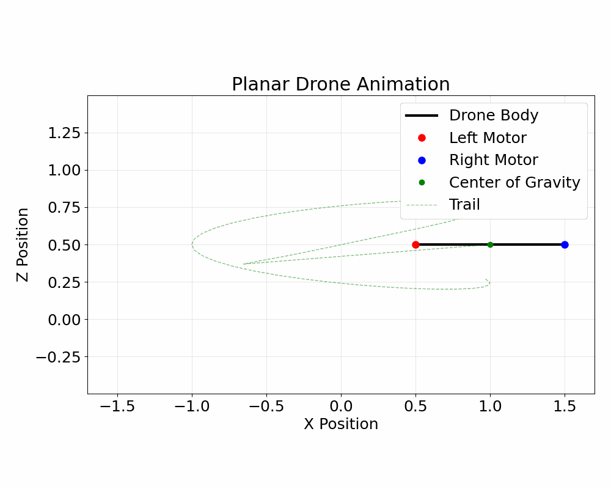

# Overview

This lesson introduces the planar drone dynamics example used throughout the course, and demonstrates how we will use model predictive control to drive the dynamics along a designed trajectory. 

## Notes

Derivation of the planar drone dynamics. 

**Key terms introduced**:
  * **States**: variables that describe the current state of the system and determine its evolution. States are only assumed to be known if there are measurements of them available. 
    * **Dynamic states**: states of the dynamical system that vary in time
    * **Static states**: states of the dynamical system that do NOT vary in time
  * **Controls**: known inputs to the system that together with the states determine its evolution. 
  * **Parameters**: constant values that are assumed to be known (and therefore will not need to be estimated)
 

## Notebook A

Topics covered:
  * Introduction of continuous dynamics functions of the form $\mathbf{\dot{x}}=\mathbf{f}(\mathbf{x},\mathbf{u})$
  * Using latex (in jupyter cells) to display dynamics with colored highlighting
  * Integrating dynamics with `odeint`
  * Designing a trajectory and using model predictive control to determine the control inputs needed to follow it
    * We use a `pybounds` wrapper for functionality provided by `casadi` and `do_mpc`
  * Formatting data into a dataframe using `pandas` and saving to .hdf files

## Notebook B

Topics covered:
  * Loading a `pandas` dataframe
  * Demo of building a `matplotlib` animation using LLM coding 

# Pre-requisites

This lesson assumes working knowledge in the following topics:
1. Basic background in continuous time dynamics
2. Writing python functions and using python packages
3. High level understanding of feedback control -- we will use model predictive control throughout the course, but background in how it works is not necessary

# Reusable Utility Functions 

This notebook introduces the dynamics functions `f(x,u)` and `h(x,u)` introduced in this notebook and the model predictive control framework form the basis of utility functions in `../Utility/planar_drone.py` that used throughout the course. 
