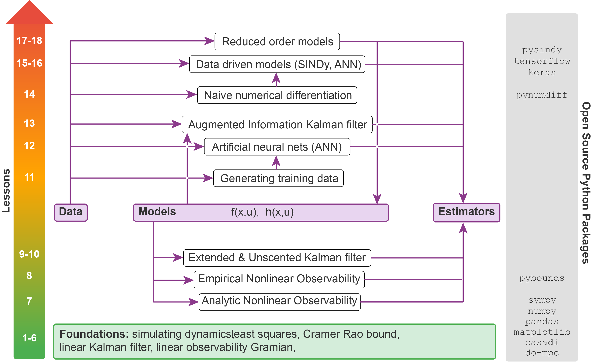

# Nonlinear and Data Driven Estimation

A comprehensive course on nonlinear and data-driven estimation techniques taught by Floris van Breugel. This repository contains Jupyter notebooks, Python implementations, and practical examples covering fundamental concepts from batch estimation to advanced data-driven techniques using neural networks and dimensionality reduction.



## 📚 Course Progression

The course is designed to follow a single example, a planar drone, throughout the sequence of lessons to help build intuition and see how the tools stack together. This example is intended to serve as a template for how other projects can be applied to the sequence of lessons. The course material is designed to build progressively:

**Foundation (Lessons 1-6):** Classical estimation theory, from batch least squares to the Kalman filter

**Observability Analysis (Lessons 7-8):** Understanding what can be estimated from available measurements

**Nonlinear Filtering (Lessons 9-10):** Extended and Unscented Kalman Filters for nonlinear systems

**Data-Driven Methods (Lessons 11-16):** Machine learning approaches including ANNs and SINDy

**Dimensionality Reduction (Lessons 17-18):** Dimensionality reduction and reduced-order estimation for ANNs

## 📚 Getting Started

New to the course? Check out our [**Tips on Getting Started with GitHub, Google Colab, and Docker**](github_colab_tips.md) to set up your development environment.

---

## 📖 Course Contents


### Lesson 0: Notebook Setup
**Topics:**
- Introduction to google colab notebook environment
- Introduction to installing and important python packages and custom utilities

---

### Lesson 1: Dynamics Demo
**Topics:**
- Planar drone dynamics modeling and simulation
- Control affine system representation
- Animation and visualization of dynamical systems
- Introduction to PyBounds for using Model Predictive Control

---

### Lesson 2: Batch Least Squares
**Topics:**
- Parameter estimation fundamentals
- Linear least squares (batch processing)
- Statistical foundations of least squares estimation
- Error analysis and uncertainty quantification

---

### Lesson 3: Sequential Least Squares
**Topics:**
- Linear sequential estimation algorithms
- Random variables and covariance analysis

---

### Lesson 4: Minimum Variance Estimation and Cramér-Rao Bound
**Topics:**
- Minimum variance estimation theory
- Cramér-Rao Lower Bound (CRLB)

---

### Lesson 5: Discrete Linear Kalman Filter
**Topics:**
- Linearizing continuous-time nonlinear models
- Discretization techniques for dynamic systems
- Discrete-time Kalman filter derivation and implementation
- Understanding Kalman filter limitations

---

### Lesson 6: Linear Observability
**Topics:**
- Observability fundamentals for linear systems
- Observability matrix and Gramian
  
---

### Lesson 7: Analytical Nonlinear Observability
**Topics:**
- Nonlinear observability analysis using symbolic computation
- Monocular camera example case study

---

### Lesson 8: Empirical Nonlinear Observability
**Topics:**
- Empirical observability matrix computation
- PyBounds framework for empirical analysis
- Custom simulator integration with PyBounds
  
---

### Lesson 9: Extended Kalman Filter
**Topics:**
- Extended Kalman Filter (EKF) theory
- EKF implementation for planar drone
- Comparison with linear Kalman filter

---

### Lesson 10: Unscented Kalman Filter
**Topics:**
- Unscented Kalman Filter (UKF) algorithm
- Sigma point generation and propagation
- Comparison of EKF vs. UKF performance

---

### Lesson 11: Generating Training Data
**Topics:**
- Training dataset creation from simulations
- Data visualization and validation

---

### Lesson 12: Artificial Neural Network Estimators
**Topics:**
- Neural network-based state estimation
- ANN architecture design for estimation problems
- Training and evaluating ANN estimators
- Application to planar drone altitude estimation

---

### Lesson 13: AI Kalman Filter
**Topics:**
- Hybrid AI-Kalman filtering approaches
- Integrating neural networks with UKF

---

### Lesson 14: Naive Numerical Differentiation
**Topics:**
- Numerical differentiation from noisy data
- PyNumDiff library and methods
- Smoothing and filtering techniques

---

### Lesson 15: SINDy (Sparse Identification of Nonlinear Dynamics)
**Topics:**
- Discovering governing equations from data 
- PySINDy library for sparse regression
- Learning dynamics and measurement models from data
- Integration with UKF for state estimation

---

### Lesson 16: Artificial Neural Network Models
**Topics:**
- Neural network-based dynamics and measurement models
- Data-driven UKF with learned models

---

### Lesson 17: Dimensionality Reduction with SVD
**Topics:**
- Singular Value Decomposition (SVD) theory for compression
- Terrain and optic flow data analysis
- Reduced-order representations of high-dimensional data

---

### Lesson 18: Reduced-Order ANN Estimator
**Topics:**
- ANN training on compressed representations
- Performance evaluation of ROM-ANN estimators

---

## 🎯 Learning Objectives

By completing this course, you will:
- Master classical estimation theory from batch to sequential methods
- Understand and implement Kalman filtering for linear and nonlinear systems
- Analyze observability for both linear and nonlinear systems
- Apply modern data-driven techniques including neural networks and SINDy
- Combine classical filtering with machine learning for hybrid estimators
- Perform dimensionality reduction for high-dimensional estimation problems
- Develop practical skills in state estimation for autonomous systems

## 🛠️ Tools & Technologies

- **Python 3.x**
- **Jupyter Notebooks**
- **NumPy / SciPy** - Numerical computing
- **Matplotlib** - Visualization
- **SymPy** - Symbolic mathematics
- **TensorFlow / Keras** - Neural networks
- **PySINDy** - Sparse identification of nonlinear dynamics
- **PyNumDiff** - Numerical differentiation
- **PyBounds** - Empirical observability analysis

## 📂 Repository Structure

Each lesson directory contains:
- Jupyter notebooks with theory, examples, and exercises
- Solution notebooks (marked with `_SOLUTION` or `_SOLUTIONS`)
- PDF lecture notes and derivations
- README files with additional context
- Links to text and video references

## 🚀 Running the Code

### Option 1: Local Installation
```bash
git clone https://github.com/florisvb/Nonlinear_and_Data_Driven_Estimation.git
cd Nonlinear_and_Data_Driven_Estimation
# Install dependencies -- see `requirements_minimal.txt` and `Utility/Requirements`
jupyter notebook
```

### Option 2: Google Colab
All notebooks can be run directly in Google Colab. See [github_colab_tips.md](github_colab_tips.md) for instructions.

## 👨‍🏫 About

This course material is developed and maintained by [Floris van Breugel](https://github.com/florisvb), Associate Professor in Mechanical Engineering at the University of Nevada, Reno.

## 📄 License

This work is licensed under [Creative Commons Attribution-NonCommercial-ShareAlike 4.0 International (CC BY-NC-SA 4.0)](https://creativecommons.org/licenses/by-nc-sa/4.0/).

**In brief:** You are free to use and adapt these materials for non-commercial educational purposes with attribution. Commercial use requires permission. See [LICENSE](LICENSE) for full details.

[](https://creativecommons.org/licenses/by-nc-sa/4.0/)

## 🤝 Contributing

Contributions, issues, and feature requests are welcome! Feel free to check the issues page or submit pull requests.

---

*This course bridges classical control and estimation theory with modern data-driven machine learning approaches, providing students with both theoretical foundations and practical implementation skills.*
