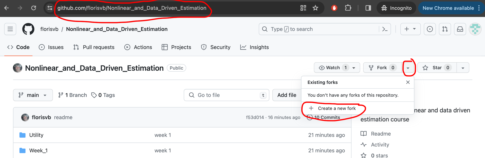
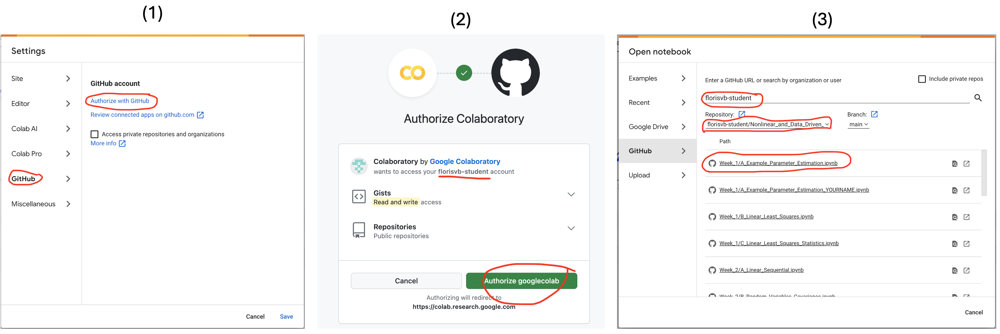
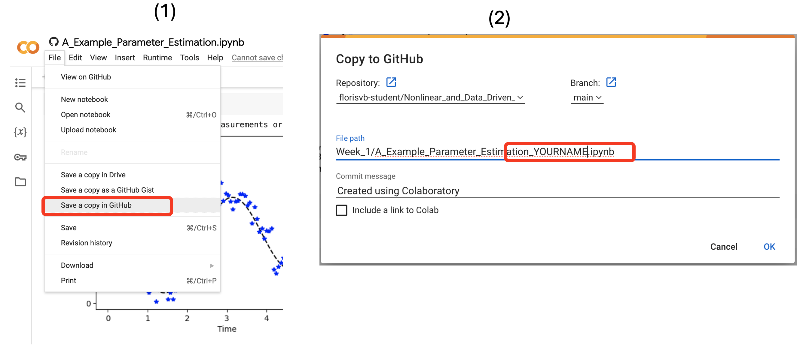
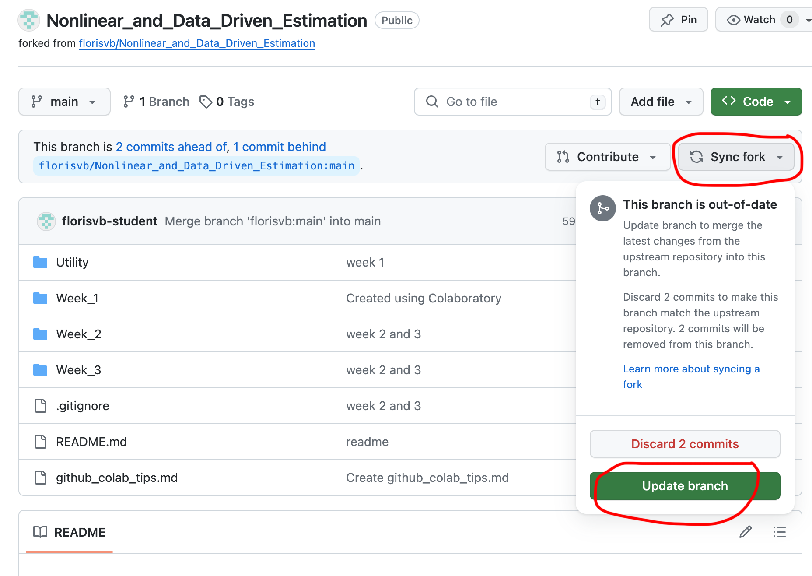
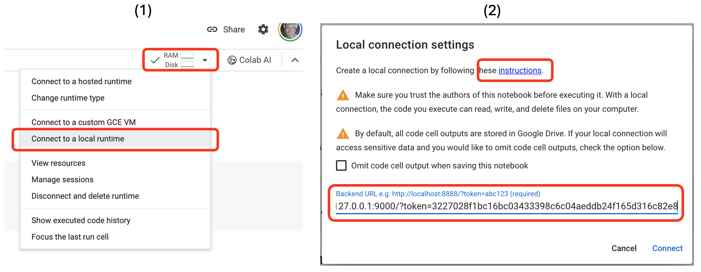

# Fork this repository

1. Log into your github account (make one if necessary)
2. Navigate to the [course repository](https://github.com/florisvb/Nonlinear_and_Data_Driven_Estimation)
3. Click fork > create a new fork, use default settings to create the fork. Now you have your own copy of the course code repository that is linked back to the original. 

# Run notebooks in google colab

1. Log into [google colab](https://colab.research.google.com/) using your google account
2. When it says "open a notebook" select "GitHub"
3. Authorize with github -- make sure your username is shown
4. Enter your username and find the repository named `Nonlinear_and_Data_Driven_Estimation` (which you forked to your own account above)
8. Select a notebook, it will open in google colab, you should be able to run the notebook

### Saving changes
If you make changes and wish to save them (recommended):
1. Click File > Save a copy in GitHub
2. Change the file name to include your name (to make it unique) -- this will ensure that you don't lose your work later

# Sync your repository with the course repository

Throughout the course I will add more code to the repository. To pull in the new code **without losing your edits**: 
1. Navigate to your fork of the repository in github
2. Click sync fork > update branch -- you will get the new code
3. Important: do no click "discard X commits" -- that will destroy your notebook copies!

# Run notebooks in google colab locally with docker

By default, google colab lets you run the notebook for free on their servers. If this is too slow, or you run out of free compute, you can run colab locally using docker. 
1. Click the RAM/Disk symbol, and choose "connect to a local runtime"
2. Follow the instructions link, "Option 1. Colab Docker runtime image" (Docker should already be installed on computer lab computers, otherwise download Docker desktop)
3. Copy the command: `docker run -p 127.0.0.1:9000:8080 us-docker.pkg.dev/colab-images/public/runtime`
4. Run the command -- the first time you run it lots of things will download and it will take a while. Next time should be much faster
     *  Windows: use the command prompt
     *  Mac: use the terminal
5. After the command is done running, copy the URL the terminal shows, like this: `http://127.0.0.1:9000/?token=3227028f1bc16bc03433398c6c04aeddb24f165d316c82e8`
6. Paste the URL into the box in google colab and click connect
7. Now you should be running the notebook using your local compute resources

